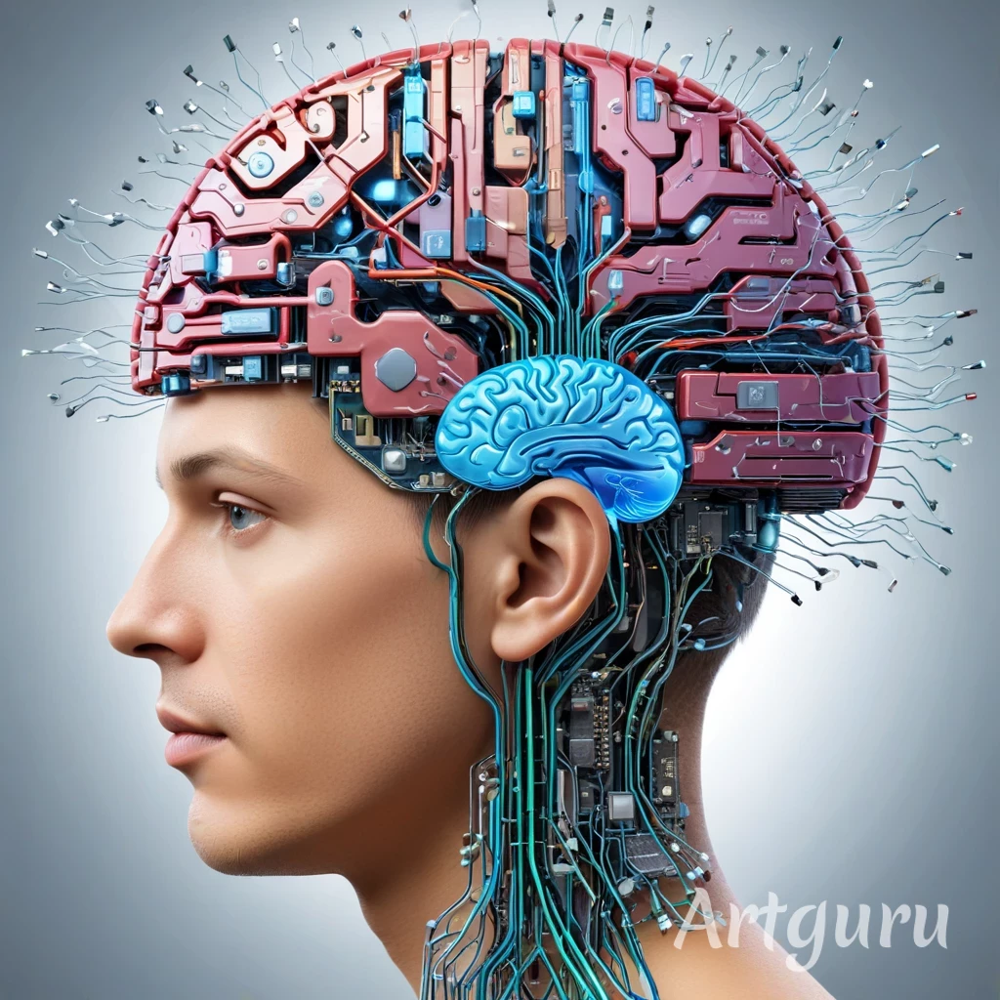
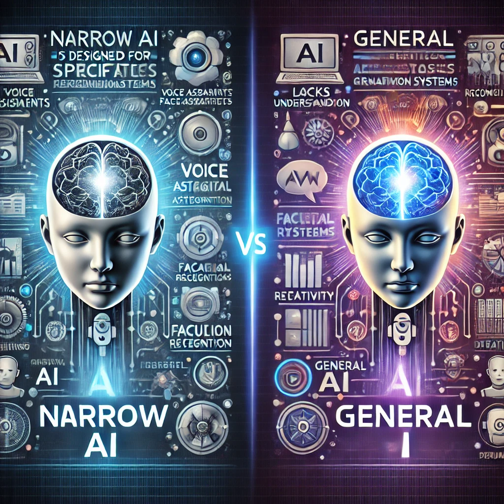
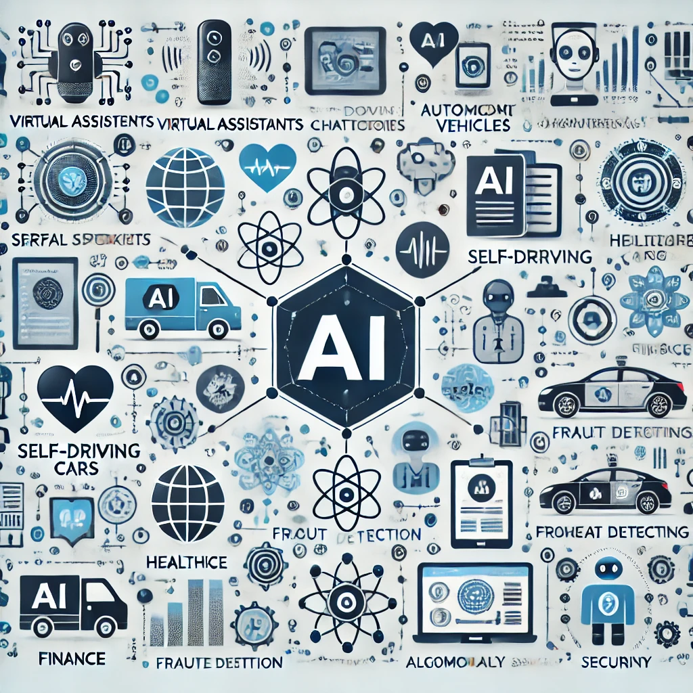
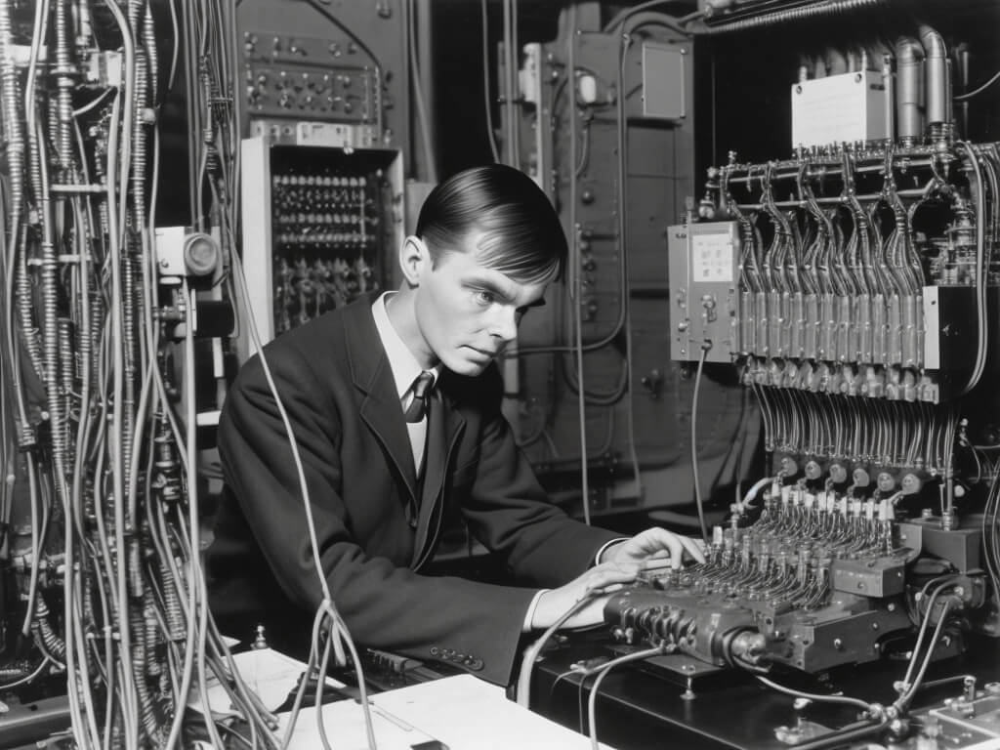
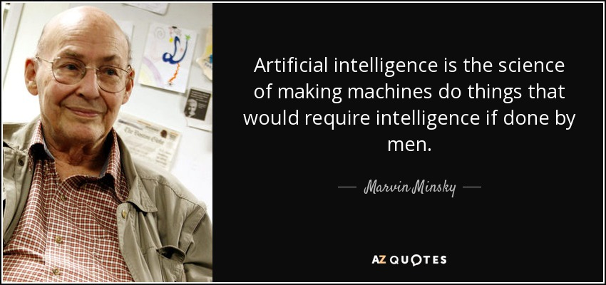
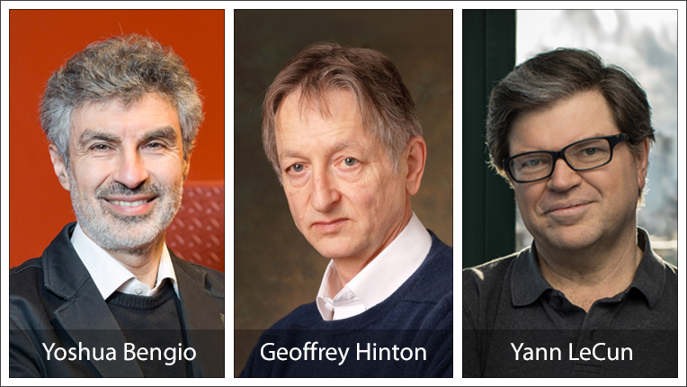

# Aula: Introdução à Inteligência Artificial (IA)

## Objetivo da Aula
Fornecer uma visão geral sobre Inteligência Artificial (IA), sua origem, evolução e o estado da arte (SOTA), destacando principais avanços e aplicações.

<!--## Duração Estimada: 1h30-->

A imagem representa a **fusão entre um cérebro humano e circuitos eletrônicos**, simbolizando a integração entre a inteligência biológica e a artificial. Aqui estão os principais conceitos que essa representação transmite:  

### 🧠 **Cérebro Humano**  
- Simboliza a **inteligência natural**, incluindo criatividade, emoções, pensamento crítico e aprendizado adaptativo.  
- Representa o funcionamento do cérebro humano, que aprende por meio da experiência e interações sociais.  

### ⚡ **Circuitos Eletrônicos**  
- Representam a **inteligência artificial**, baseada em algoritmos, redes neurais e aprendizado de máquina.  
- Mostram a capacidade da tecnologia de processar grandes quantidades de dados rapidamente e tomar decisões baseadas em padrões.  

### 🔗 **Integração: Cognição Humana + Tecnologia**  
- Destaca como a IA pode ampliar as habilidades humanas, auxiliando na tomada de decisão, automação de tarefas e otimização de processos.  
- Ilustra conceitos como **Neurotecnologia**, **IA Cognitiva** e **Interface Cérebro-Computador (BCI - Brain-Computer Interface)**.  
- Sugere um futuro onde humanos e máquinas trabalham juntos de forma complementar, potencializando o conhecimento e a inovação.  

---

### 1. O que é Inteligência Artificial? <!--(20 min)-->

#### Definição
- Inteligência Artificial (IA) refere-se a sistemas computacionais que podem realizar tarefas que normalmente requerem inteligência humana.
- Engloba subáreas como aprendizado de máquina (Machine Learning), processamento de linguagem natural (NLP), visão computacional e robótica.

#### Tipos de IA
- **IA Fraca (Narrow AI):** Projetada para executar uma tarefa específica (ex: assistentes virtuais, sistemas de recomendação).
- **IA Forte (General AI):** Capaz de executar qualquer tarefa intelectual que um humano possa realizar (ainda teórica).
- **Superinteligência:** Conceito futurista de IA que supera a inteligência humana em todas as áreas.

A ilustração compara **IA Fraca (Narrow AI)** e **IA Forte (General AI)**, destacando suas principais diferenças em termos de funcionalidade, capacidade e aplicações. Vamos analisar os detalhes da imagem:  

### 📌 **Lado Esquerdo: IA Fraca (Narrow AI)**  
- Representada por ícones de tecnologias específicas, como **assistentes virtuais, reconhecimento facial e sistemas de recomendação**.  
- Características principais:  
  - **Especializada em uma única tarefa** (exemplo: um chatbot não pode dirigir um carro).  
  - **Não possui compreensão geral ou consciência**.  
  - Exemplo: **Siri, Google Translate, AlphaGo, carros autônomos atuais**.  
- Aplicações comuns:  
  - Assistentes de voz (Alexa, Siri).  
  - Diagnóstico médico com IA.  
  - Análises preditivas para e-commerce.  

### 📌 **Lado Direito: IA Forte (General AI)**  
- Simbolizada por um **robô humanoide com cérebro brilhando**, indicando **capacidade de aprendizado e adaptação em diferentes contextos**.  
- Características principais:  
  - **Pode realizar qualquer tarefa intelectual que um humano possa fazer**.  
  - **Possui capacidade de raciocínio, aprendizado adaptativo e criatividade**.  
  - Ainda **não existe** plenamente na prática, mas é um objetivo da pesquisa em IA.  
- Potenciais aplicações:  
  - Robôs humanoides multifuncionais.  
  - Sistemas de IA capazes de aprender qualquer habilidade nova sem reprogramação.  
  - Tomada de decisão autônoma em qualquer setor.  

### 🔗 **Conexão entre as áreas**  
A ilustração mostra a transição entre a IA Fraca e a IA Forte, evidenciando que estamos atualmente no estágio da IA Fraca, enquanto a IA Forte continua sendo um objetivo para o futuro da pesquisa.  

### Aplicações Atuais
- Assistentes virtuais (Siri, Alexa, Google Assistant)
- Veículos autônomos
- Diagnóstico médico assistido por IA
- Processamento de linguagem natural (ChatGPT, Bard, etc.)
- Reforço na cibersegurança

### Áreas destacadas:

Este infográfico ilustra as diversas aplicações da Inteligência Artificial (IA) em diferentes setores da sociedade. Ele está dividido em várias áreas, cada uma destacando um campo onde a IA está sendo amplamente utilizada. Vamos analisar cada seção:  

### 1️⃣ **Assistentes Virtuais**  
- Representado por ícones de smart speakers e chatbots.  
- Inclui tecnologias como **Siri, Alexa, Google Assistant**, que utilizam **Processamento de Linguagem Natural (NLP)** para entender e responder a comandos de voz.  
- Aplicações: suporte ao usuário, automação residencial, pesquisa por voz.  

### 2️⃣ **Veículos Autônomos**  
- Mostra imagens de **carros autônomos e drones**.  
- IA é usada em sensores, visão computacional e aprendizado de máquina para **navegação segura e tomada de decisões em tempo real**.  
- Empresas como Tesla, Waymo e Uber desenvolvem essa tecnologia.  

### 3️⃣ **Saúde e Diagnóstico Médico**  
- Representado por equipamentos médicos e IA assistindo diagnósticos.  
- IA ajuda a analisar exames de imagem, detectar **doenças precocemente** e sugerir tratamentos.  
- Aplicações: diagnósticos baseados em **redes neurais**, cirurgia assistida por robôs, descoberta de medicamentos.  

### 4️⃣ **Finanças e Segurança**  
- Inclui **detecção de fraudes** e **trading algorítmico**.  
- Bancos e corretoras utilizam IA para prever padrões de mercado e analisar riscos.  
- Algoritmos são usados para **detectar transações suspeitas** em tempo real.  

### 5️⃣ **Cibersegurança**  
- Mostra um escudo digital simbolizando proteção de dados.  
- IA analisa padrões de comportamento para identificar **ameaças e ataques cibernéticos** antes que ocorram.  
- Aplicações: firewalls inteligentes, detecção de malwares, proteção contra phishing.  

### 🔗 **Conexão entre as áreas**  
O design do infográfico demonstra como a IA **interliga** diferentes setores da sociedade, mostrando sua ampla influência no cotidiano.  

---
### *Quais exemplos de IA que usam no dia a dia?*

# 2. Origens da Inteligência Artificial <!--(20 min)-->

### Contexto Histórico
- **Década de 1940-1950:** Primeiros conceitos matemáticos sobre IA (Alan Turing, Teste de Turing). [Detalhes](./teste_turing.md)
- **1956:** Conferência de Dartmouth, onde o termo "Inteligência Artificial" foi cunhado por John McCarthy.
- **Décadas de 1960-1970:** Primeiros sistemas especialistas e avanços em algoritmos de busca.
- **Décadas de 1980-1990:** Aprendizado de máquina ganha força com redes neurais e aumento do poder computacional.
- **Anos 2000 em diante:** Big Data, deep learning e aplicações escaláveis de IA.

### Principais Nomes
- **Alan Turing:** Pai da computação moderna. 
- 
- **John McCarthy:** Criador do termo "Inteligência Artificial".  
- 
- **Marvin Minsky:** Contribuições fundamentais para redes neurais e cognição artificial. 
- 
- **Geoffredy Hinton, Yann LeCun e Yoshua Bengio:** Pioneiros do deep learning.
- 

[Prêmio Nobel para precursores em IA - 2024](https://www.bbc.com/portuguese/articles/c7493vx4jw2o)

___

### *Discussão: Como a IA evoluiu desde suas primeiras ideias?*

# 3. Evolução da Inteligência Artificial <!--(30 min)-->

### Fases do Desenvolvimento
- **1ª Onda (Regras e Lógica):** Sistemas especialistas baseados em regras (anos 1950-1980).
- **2ª Onda (Aprendizado de Máquina):** Modelos estatísticos e aprendizado supervisionado (anos 1990-2010).
- **3ª Onda (Deep Learning e Grandes Modelos de Linguagem):** Redes neurais profundas, processamento de grandes volumes de dados (2010 em diante).
- **4ª Onda (IA Generativa e Multimodalidade):** Modelos como ChatGPT, DALL-E, Gemini e avanços em IA conversacional e criativa.

### Marco Importantes
- 1997: Deep Blue vence Garry Kasparov no xadrez.
- 2011: IBM Watson vence o Jeopardy!
- 2016: AlphaGo vence campeão mundial de Go.
- 2020+: Popularização de modelos de IA generativa (GPT-3, Stable Diffusion, MidJourney, etc.).

**Atividade:** Exibir trechos de jogos de IA (ex: AlphaGo vs. Lee Sedol) e discutir os impactos na percepção da IA.

[YouTube - AI vence melhor jogador de Go ](https://www.youtube.com/watch?v=NumBcAvmHS4&ab_channel=TimesOfIndia)

---

# 4. SOTA (State-of-the-Art) da IA <!--(20 min)-->

### **O que é SOTA (State of the Art) em IA?**  
SOTA (**State of the Art**) refere-se ao **estado da arte** em Inteligência Artificial, ou seja, as melhores técnicas, modelos e abordagens disponíveis em um determinado momento. Um sistema de IA é considerado **SOTA** quando supera os métodos anteriores em **benchmarks**, que são testes padronizados para avaliar o desempenho em tarefas específicas.  

---

### **Benchmark Humano e Desempenho Esperado da IA**  
Os benchmarks servem como referência para medir o desempenho de modelos de IA em comparação com a capacidade humana. Dependendo da tarefa, o objetivo da IA pode variar:  

🔹 **Abaixo do desempenho humano** (*Sub-Human Performance*):  
- O sistema ainda **não consegue superar humanos** na tarefa.  
- Exemplo: Modelos iniciais de visão computacional falhavam em reconhecer objetos tão bem quanto humanos.  

🔹 **No nível humano** (*Human-Level Performance*):  
- A IA **alcança desempenho similar ao de um especialista humano**.  
- Exemplo: Modelos como **GPT-4** podem gerar textos em diversos estilos, mas ainda têm dificuldades com raciocínio profundo e criatividade genuína.  

🔹 **Acima do nível humano** (*Super-Human Performance*):  
- O sistema de IA **supera os humanos** em precisão, velocidade e eficiência.  
- Exemplo:  
  - **DeepMind’s AlphaGo** derrotou campeões mundiais de Go, pois analisa milhões de jogadas possíveis em segundos.  
  - **Diagnóstico por IA** já superou médicos em detectar certos tipos de câncer a partir de imagens médicas.  

---

### **Importância do Benchmark e seus Limites**  
- **Avanço Contínuo**: O que é **SOTA hoje pode não ser amanhã**, pois a IA está sempre evoluindo.  
- **Diferenças Contextuais**: Nem todas as tarefas têm um benchmark humano claro; por exemplo, um modelo pode criar arte única sem referência direta.  
- **Interpretação Cautelosa**: Mesmo que uma IA supere humanos em um benchmark, isso **não significa que tenha compreensão real** — apenas otimização estatística para aquele problema.  

---

### Principais Avanços Recentes
- **Grandes Modelos de Linguagem (LLMs):** ChatGPT, Gemini, Claude.
- **IA Generativa:** Criação de imagens, vídeos, textos e músicas realistas.
- **IA Multimodal:** Modelos capazes de combinar texto, imagem, áudio e vídeo.
- **IA na Saúde:** Diagnósticos mais precisos, descoberta de fármacos.
- **Veículos Autônomos:** Testes avançados e aplicações em logística.
- **Computação Quântica e IA:** Avanços promissores para problemas complexos.

### Desafios e Limitações
- **Viés e discriminação:** Modelos podem refletir preconceitos existentes nos dados.
- **Consumo de energia:** Modelos de IA requerem grande poder computacional.
- **Regulamentação e ética:** Impactos no trabalho, privacidade e segurança digital.

**Discussão Final:** O futuro da IA é mais positivo ou preocupante? Como podemos usá-la de forma ética?

---

# 5. IA Generativa vs. IA Discriminativa 

A Inteligência Artificial pode ser categorizada em **IA Generativa** e **IA Discriminativa**, dependendo da maneira como processa e gera dados.  

---

## **1️⃣ IA Generativa** 🏗️🎨  
A **IA Generativa** é projetada para **criar novos dados** a partir de padrões aprendidos em um conjunto de treinamento.  

🔹 **Como funciona?**  
- Aprende a modelar a **distribuição dos dados** e gera novas amostras que parecem reais.  
- Usa modelos como **Redes Generativas Adversárias (GANs)** e **Modelos de Difusão** (exemplo: DALL·E, Stable Diffusion).  
- Também inclui **Modelos de Linguagem** como o **GPT-4** e o **Gemini**, que geram textos coerentes e criativos.  

🔹 **Exemplos de Aplicação**  
✅ Geração de imagens e vídeos (DALL·E, MidJourney).  
✅ Produção de texto (ChatGPT, Bard).  
✅ Criação de música e arte digital.  
✅ Síntese de voz e deepfakes.  

---

## **2️⃣ IA Discriminativa** 🔍⚖️  
A **IA Discriminativa** é usada para **classificar e diferenciar dados**, aprendendo a tomar decisões sobre os padrões que encontra.  

🔹 **Como funciona?**  
- Em vez de gerar novos dados, a IA tenta prever **probabilidades e categorias** com base nos dados de entrada.  
- Modelos como **Redes Neurais Convolucionais (CNNs)** e **Transformers** são usados para classificação e reconhecimento de padrões.  

🔹 **Exemplos de Aplicação**  
✅ **Detecção de fraudes** (bancos analisam transações suspeitas).  
✅ **Diagnóstico médico** (identificação de doenças em exames de imagem).  
✅ **Reconhecimento facial** (sistemas de segurança).  
✅ **Classificação de e-mails** (filtros de spam).  

---

### 🔥 **Principais Diferenças**  

| Característica  | IA Generativa  | IA Discriminativa  |
|---------------|---------------|----------------|
| **Objetivo**  | Criar novos dados  | Classificar ou diferenciar dados  |
| **Exemplos**  | Geração de texto, imagens e voz  | Diagnóstico médico, detecção de fraudes  |
| **Modelos Famosos**  | GANs, Diffusion Models, GPT-4, DALL·E  | CNNs, Transformers para classificação  |
| **Entrada/Saída**  | Entrada → Geração de nova amostra  | Entrada → Classificação ou predição  |

---

### **📌 Conexão entre as duas abordagens**  
🔹 IA Generativa e IA Discriminativa podem trabalhar **juntas**!  
🔹 **Exemplo:** Em uma **GAN (Rede Generativa Adversária)**, uma IA Generativa cria imagens falsas enquanto uma IA Discriminativa tenta distinguir imagens reais das falsas, melhorando a qualidade das amostras geradas.  

Se precisar de mais detalhes ou exemplos específicos, me avise! 🚀

## Conclusão e Encerramento <!--(10 min)-->
- Revisão dos principais conceitos abordados.
- Reflexão sobre o impacto da IA na sociedade e no futuro do trabalho.
- Indicação de leituras e materiais extras para aprofundamento.

**Pergunta Final:** Como você acha que a IA afetará sua área de atuação nos próximos anos?

