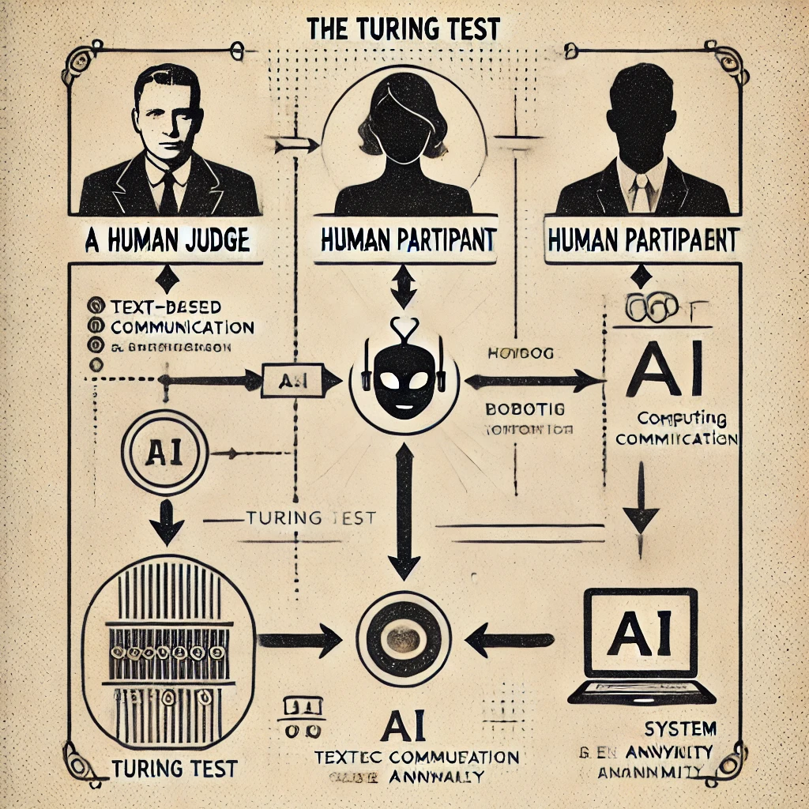

### **Teste de Turing: O que é e como funciona?**  

O **Teste de Turing** foi proposto em 1950 pelo matemático e cientista da computação **Alan Turing** para determinar se uma máquina pode exibir um comportamento inteligente indistinguível do de um ser humano.  

---

## **🧠 Como funciona o Teste de Turing?**  
- Há **três participantes**:  
  1️⃣ Um **humano (A)**  
  2️⃣ Um **computador (B)**  
  3️⃣ Um **juiz humano (C)**  

- O juiz interage com A e B por meio de **texto** (para evitar que a aparência física influencie a decisão).  
- Se, após uma série de perguntas e respostas, o juiz **não conseguir distinguir** o computador do humano, a máquina passa no teste.  

### 📌 **Objetivo**  
- Avaliar se a IA pode **imitar a inteligência humana** de forma convincente.  
- Não mede *consciência* ou *raciocínio verdadeiro*, apenas a capacidade de simular respostas humanas.  

---

## **🤖 IA e o Teste de Turing Hoje**  
🔹 **Sistemas como ChatGPT podem enganar humanos em conversas curtas**, mas ainda falham em conversas longas e complexas.  
🔹 **Superar o teste não significa que a IA "pensa" como um humano**, apenas que simula bem uma conversa.  
🔹 Modelos mais avançados tentam não apenas "enganar", mas também **raciocinar e compreender o mundo**.  

---

### **📍 Limitações do Teste de Turing**  
✅ Mede a **capacidade de imitação**, mas não garante compreensão real.  
✅ Muitos sistemas de IA podem passar no teste, mas ainda **não possuem consciência ou intencionalidade**.  
✅ Não avalia outras formas de inteligência (como criatividade, emoções e aprendizado independente).  

Embora o Teste de Turing seja um marco na IA, novas abordagens estão sendo desenvolvidas para avaliar **inteligência real** além da simples imitação.  

